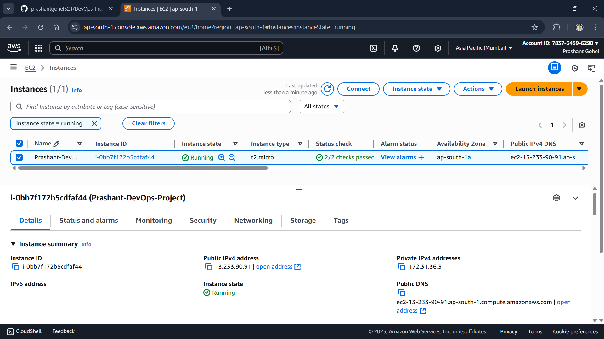
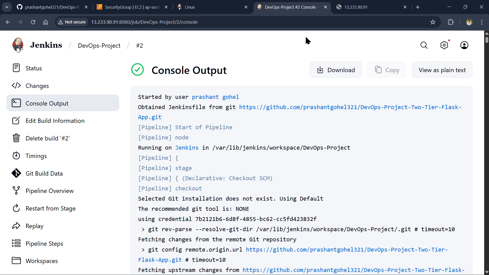

# 🚀 Server Inventory App - Production-Style CI/CD Deployment on AWS


---

# 📌 Project Overview

This project demonstrates a complete production-style deployment pipeline for a containerized FastAPI application running on AWS EC2.

The application is deployed using Docker Compose, while Jenkins automates the build and deployment process whenever new code is pushed to GitHub using GitHub Webhooks.

Instead of manually deploying the application after every code change, the complete deployment process is fully automated through a CI/CD pipeline.

---

# 🎯 Objectives

* Deploy a FastAPI application on AWS EC2
* Containerize the application using Docker
* Use Docker Compose for multi-container deployment
* Deploy MySQL alongside the application
* Configure Jenkins as the CI/CD server
* Automate deployment using GitHub Webhooks
* Learn production troubleshooting techniques

---

# 🏗️ Architecture

                  Developer

                      │
                  git push

                      │

                 GitHub Repository

                      │
              GitHub Webhook

                      │

                 Jenkins Pipeline

          ┌───────────┴───────────┐
          │                       │
     Build Docker Image      Pull Latest Code
          │
          └───────────┬───────────┘
                      │
              Docker Compose
                      │
        ┌─────────────┴──────────────┐
        │                            │
   FastAPI Container          MySQL Container
        │
        └───────────────┐
                        │
                  AWS EC2 Instance
```

---

# ⚙️ Technology Stack

## Cloud

* AWS EC2
* Ubuntu Linux

## Backend

* FastAPI
* Python 3.11

## Database

* MySQL 8

## DevOps

* Docker
* Docker Compose
* Jenkins
* GitHub Webhooks

## Version Control

* Git
* GitHub

---

# ✨ Features

* REST API built with FastAPI
* MySQL database integration
* Dockerized application
* Docker Compose orchestration
* Jenkins Pipeline
* Automatic deployment after Git Push
* Health Check for MySQL
* GitHub Webhook Integration
* Production-style CI/CD workflow

---

# 📂 Project Structure

```
server-inventory-app/

│── app/
│── Dockerfile
│── docker-compose.yml
│── Jenkinsfile
│── requirements.txt
│── README.md
```

---

# 🚀 CI/CD Workflow

```
Developer
    │
git push
    │
    ▼
GitHub
    │
Webhook Trigger
    │
    ▼
Jenkins
    │
Checkout Code
    │
Docker Build
    │
Docker Compose
    │
Deploy Containers
    │
Application Updated
```

---

# 🔄 Jenkins Pipeline

The Jenkins pipeline performs the following tasks:

* Checkout source code
* Build Docker image
* Deploy containers using Docker Compose
* Automatically update the running application

---

# 🌐 Deployment

Application runs on

```
http://<EC2-PUBLIC-IP>:8000
```

Jenkins Dashboard

```
http://<EC2-PUBLIC-IP>:8080
```

---

# 📦 Docker Services

This project deploys two containers.

### FastAPI

* REST API
* Python Backend
* Port 8000

### MySQL

* MySQL 8
* Stores inventory information
* Port 3306

---

# 📈 CI/CD Pipeline

```
Git Push
      │
      ▼
GitHub Repository
      │
      ▼
GitHub Webhook
      │
      ▼
Jenkins
      │
      ▼
Docker Build
      │
      ▼
Docker Compose
      │
      ▼
Application Deployment
```

---

# 🔧 Problems Solved During Development

This project involved solving several real-world DevOps problems.

✅ Docker Permission Denied

* Added Jenkins user to Docker group

---

✅ MySQL Container Startup Order

* Implemented Docker Health Checks
* Used depends_on with service_healthy

---

✅ Jenkins Node Offline

* Diagnosed disk space issue
* Expanded AWS EBS Volume
* Resized Linux filesystem

---

✅ Docker Container Conflicts

* Managed existing containers during deployments

---

✅ GitHub Automation

* Configured GitHub Webhooks
* Enabled automatic Jenkins builds

---

# 📚 What I Learned

* AWS EC2 Management
* Linux Administration
* Docker
* Docker Compose
* Jenkins Pipelines
* GitHub Webhooks
* CI/CD Automation
* Docker Networking
* Container Troubleshooting
* Storage Expansion in Linux
* Production Deployment Workflow

---

# 🚀 Future Improvements

* Deploy using Nginx Reverse Proxy
* Configure HTTPS with Let's Encrypt
* Use Terraform for Infrastructure as Code
* Deploy with Kubernetes
* Add Monitoring using Prometheus & Grafana
* Implement Blue-Green Deployment
* Configure Automatic Backups

---

# 📷 Screenshots

Add screenshots here.

* AWS EC2

* Jenkins Dashboard

* infrastructure 

* workflow


---

# 👨‍💻 Author

**Deepak Raj**

Aspiring Linux | DevOps | Cloud Engineer

GitHub:
https://github.com/Deepakrajbr
